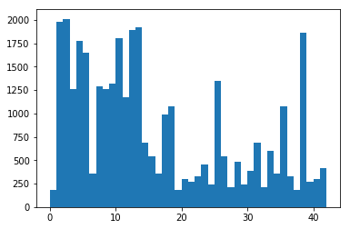
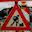
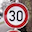
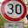
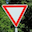

# Traffic Sign Recognition Using a Neural Network

---

The goals / steps of this project are the following:

* Load a data set of traffic sign images (see below for links to the project data set)
* Explore, summarize and visualize the data set
* Design, train and test a neural network model architecture
* Use the model to make predictions on new images
* Analyze the softmax probabilities of the new images
* Summarize the results with a written report (you're reading it!)

## 0. Library Set Up and Data Loading

The data we use for this project is the [German Traffic Sign Recognition Benchmark](http://benchmark.ini.rub.de/?section=gtsrb&subsection=dataset). Fortunately, Udacity has already pre-processed the full data to extract centered RGB images of traffic signs (32x32 pixels) and split them into train, test and validation sets, with labels. It's easy to load these into the appropriate variables from the Udacity-provided pickle file. 

## 1. Data Set Summary & Exploration

In any machine learning project, it's important to double-check that that the data are actually what they're supposed to be. I've spent many hours trying to run down bugs in my code that would have been much easier if I had done better sanity checks on the training data right at the start! In that spirit, I run the following basic checks on the training data:

1. Count the number of observations (i.e. labeled sign images) in the training, test, and validation set. This is easy with the python len() function applied to the list of labels.

2. Identify the shape of a traffic sign image. This is easy, using the .shape attribute on a slice of the training data. For simplicity, I run this on the first image in the training set (X_train[0]).

3. Count the number of classes. This is a simple use of len(), and confirms that all 43 of the traffic sign types are represented in the data.

4. Show a random image from the training data, to visually confirm that it's correct. This is easy using the python random library and matplotlib. To provide a quick test of the labeling, I also load the provided label name correspondence file (in CSV format) and print the full name of the sign that corresponds to the integer label. 

5. Ideally, training data should be evenly balanced across classes. To check this, I use the numpy unique() function to count the instances of each of the 43 labels, and then display this as a histogram. It reveals that some signs are far more represented in the training data. Using the python min() and max() functions I also check which signs are most and least represented in the training data.

Finally, I display examples of all 43 traffic signs in a grid, to get a better sense of what they all look like. In the future, I would like to improve the model accuracy by synthesizing training data, and one simple way to do this would be to invert (left-right) all images for signs that are symmetric, and add them as additional training images. A refinement to this would be to invert signs that are mirror images of other signs (e.g. left turn only/right turn only) and use them as training data for the mirror-image class. Having this visual grid of signs would enable me to determine which signs are symmetric, and which are mirror images. (I haven't done data synethesis for this project, however.) 

## 2. Data Pre-processing and Model Training

I began by using the standard LeNet architecture on the training data with no pre-processing. LeNet seems like an appropriate model to use, because its convolutional layers mean that it performs well with visual images. It's quite effective at recognizing hand-written numerals in the MNIST dataset, and many of the traffic signs are basically symbols with geometric shapes that are similar to numerals (e.g. turn arrows, diagonal slashes, etc.). The layer architecture and sizes are summarized in the table at the end of this section.

I used a training operation based on the AdamOptimizer, and a loss operation based on calculating the cross entropy between the one-hot training lables and the logits resulting from the model (all defined in the "Train, Validate and Test the Model" section of the notebook). 

With no pre-processing, and the default hyperparameters given in the course (10 epochs, batch size of 128, and a learning rate of 0.001), the model trains to a validation accuracy of 0.848. Not bad, but well below the project target of 0.93. As a quick test, I then tried increasing the learning rate to 0.005, which resulted in a model with validation accuracy 0.844. Learning faster doesn't necessarily help!

Next, I tried pre-processing the data using the simple normalization method of subtracting 128 from the pixel values and then dividing by 128. (It's important to cast the training data tensor from int to float, or this method will just result in zeros.) Normalization is important for successful training, because data with a mean value that is far from zero forces the training process to adjust the weights and bias tensors by large amounts, which is both inefficient and prone to numerical noise. Normalization clearly helped, because using the default hyperparameters (including learning rate of 0.001) the network trained to a validation accuracy of 0.926 - almost our target value.

Following this, I tried grayscaling the images and then normalizing them. This makes our model smaller (it only needs to use one color channel instead of three) so it might help. I used an RGB conversion method based on [this discussion](https://stackoverflow.com/questions/12201577/how-can-i-convert-an-rgb-image-into-grayscale-in-python). Again using the default hyperparameters, the network trained to a validation accuracy of 0.885. So this wasn't very helpful.

I next tried using learning rate decay to improve the accuracy (returning to the pre-processing step that normalized the color images in the training data, but did not grayscale them). With several variants of the decay path (inital rate = 0.002, decay steps = 500, and decay rate = 0.8 and 0.9) the final trained validation accuracy was in the range of 0.923 to 0.926. Therefore this didn't seem to help.

Finally, I modified the pre-processing step to independently normalize each color channel for each image. To do this, for each image in the training set I found the min and max pixel value in each color channel, and then scaled the pixel values for that channel so they were zero mean and had a max and min of +/-1. Using this pre-processing technique and learning rate decay, the model trained to a validation accuracy of 0.955 in ten epochs (initial learning rate = 0.005, decay steps = 500, decay rate = 0.8). It seems like image-specific, channel-dependent normalization is the way to go.

To check whether the model is over-fitting, I also calculated the training set accuracy for this model, which is 0.999. This is clear evidence of over-fitting, since the training set accuracy is much higher than the validation set accuracy. To address this, I added a dropout layer before the final fully connected layer, with a keep probability of 50%. This results in a validation accuracy of 0.954, with the training accuracy still 0.999. 

I then added a second dropout layer, before the second-to-last fully connected layer, with the same keep probability. This results in a validation accuracy of 0.957, a training accuracy of 0.994, and a test accuracy of 0.938. So this network is still over-fitting somewhat, but not as severely as without the dropout layers.

My final model architecture achieved the following accuracies:

| Data set     | Accuracy    |
|:------------:|:-----------:|
| Training     | 0.994       |
| Validation   | 0.957       |
| Test         | 0.938       |

My final model consisted of the following layers:

| Layer         		|     Description	        					| 
|:---------------------:|:---------------------------------------------:| 
| Input         		| 32x32x3 RGB image (normalized) 				| 
| Convolution 5x5     	| 1x1 stride, valid padding, outputs 28x28x6 	|
| RELU					|												|
| Max pooling	      	| 2x2 stride, valid padding, outputs 14x14x6  	|
| Convolution 5x5	    | 1x1 stride, valid padding, outputs 10x10x16   |
| RELU 					|												|
| Max pooling			| 2x2 stride, valid padding, outputs 5x5x16		|
| Flatten				| Outputs 400x1									|
| Fully connected		| Outputs 120x1	     							|
| RELU 					|												|
| Dropout  				| Drops 50% of neurons during training  		|
| Fully connected		| Outputs 84x1									|
| RELU 					|												|
| Dropout  				| Drops 50% of neurons during training  		|
| Fully connected		| Outputs 43x1									|
| Softmax				| Outputs prediction      						|

## 3. Testing the Model on New Images

I downloaded ten RGB images of German traffic signs from various sites on the web, and rescaled them to 32x32 pixels:

 
 
 
 
 

The trained network predicted 9/10 correctly. The incorrectly classified one was one of the two "30km/h" signs. Here are the results of the prediction:

| Image			        |     Prediction	   		|   Softmax   	|
|:---------------------:|:-------------------------:| :------------:|
| Right-of-way  		| Right-of-way				| 1.000			|
| Stop 		      		| Stop 						| 1.000			|
| Stop 		      		| Stop  					| 1.000			|
| Road work  			| Road work					| 0.707			|
| 30km/h  				| 30km/h  					| 1.000			|
| 30km/h    			| Keep right				| 0.842 		|
| No entry   			| No entry  				| 1.000			|
| General caution  		| General caution 			| 1.000  		|
| Turn right ahead		| Turn right ahead  		| 0.861			|
| Yield   				| Yield 					| 1.000			|

The code for the predictions and the top 5 softmax values are in the final two cells of the notebook.
